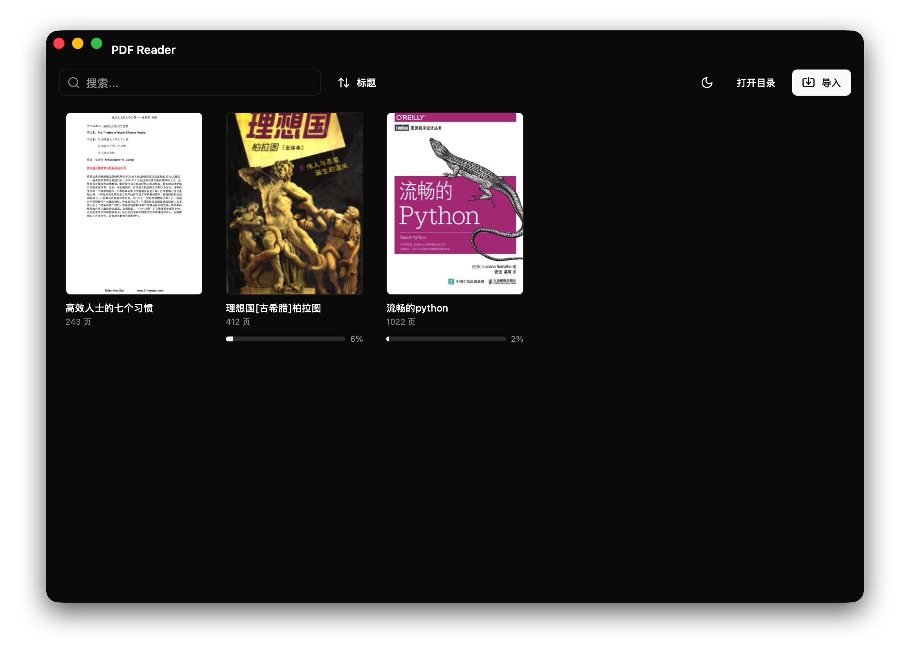
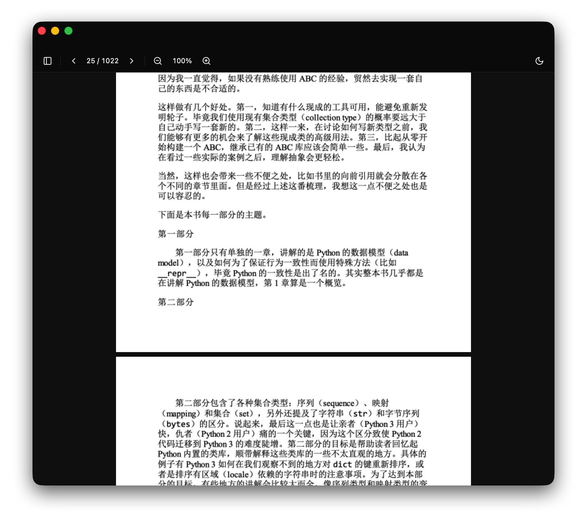

# PDF Reader

专为 macOS 打造的轻量 PDF 阅读器，支持 iCloud 多设备阅读进度同步。

[English](./README.md)

<p align="center">
  
</p>

## 功能截图

| 书库 | 阅读 |
|------|------|
|  |  |

## 功能亮点

- **书库管理** — 网格封面浏览，支持搜索过滤、按标题/日期/大小排序
- **连续滚动** — 流畅的逐页连续滚动渲染，基于优先级渲染队列
- **双指缩放** — 原生 macOS 触控板手势缩放，同时支持键盘和工具栏控制
- **侧边栏导航** — PDF 目录大纲树 + 缩略图条，快速跳转到任意页面
- **PDF 管理** — 导入、重命名、删除（移至废纸篓）、在 Finder 中显示
- **暗色模式** — 自动跟随系统外观切换
- **文件监听** — 目录内 PDF 增减时自动刷新书库
- **多窗口** — 每个 PDF 独立窗口打开，重复打开会聚焦已有窗口

## 轻量高效

基于 **Tauri 2 + Rust** 构建，直接使用系统原生 WebView，不内嵌 Chromium：

- **安装包小** — 仅 ~10 MB 级别（Electron 应用通常 100 MB+）
- **内存占用低** — 无内嵌浏览器引擎，直接利用 macOS WKWebView
- **运行流畅** — Rust 后端零 GC 开销，PDF 解析和文件操作高效无卡顿

## 阅读进度同步

PDF Reader 通过 iCloud 自动保存和同步阅读进度，在任意 Mac 上都能接续上次阅读位置。

### 工作原理

进度采用双层存储：

```
本地副本:  ~/Library/Application Support/com.yangguanlin.pdf-reader/Progress/{hash}.json
中心副本:  iCloud Drive / PDFReader / Progress / {hash}.json
```

每个进度文件携带**版本号**，每次保存时版本号递增。同步时**高版本始终胜出**，简单可靠、无冲突。

### 同步时机

| 触发事件 | 行为 |
|---------|------|
| 翻页 / 缩放变化 | 1 秒防抖后保存 |
| 定时 | 每 30 秒自动保存 |
| iCloud 轮询 | 每 3 秒拉取远端更新，发现更新版本则恢复 |
| 关闭窗口 | 关闭前强制保存 + 同步 |

### 安全保障

- **原子写入** — 先写入临时文件，再重命名替换，杜绝半写入数据损坏
- **无 iCloud 也无妨** — 自动降级到 `~/.pdf-reader/` 本地目录，进度照样保存

## 安装

### 直接下载

从 [Releases](../../releases) 页面下载最新 `.dmg` 安装包。

提供 **Apple Silicon**（arm64）和 **Intel**（x64）双架构版本。

### 从源码构建

```bash
git clone https://github.com/yangguanlin/pdf-tool-macos.git
cd pdf-tool-macos
pnpm install
pnpm tauri build     # 生成 .app + .dmg
```

> 需要：macOS 10.15+、Node.js 18+、pnpm、Rust 工具链、Xcode Command Line Tools

## 存储路径

```
~/Library/Mobile Documents/com~apple~CloudDocs/PDFReader/   # iCloud（优先）
~/.pdf-reader/                                               # 本地降级
  ├── Books/           # PDF 文件
  ├── Progress/        # 阅读进度（中心副本）
  └── Thumbnails/      # 封面缩略图缓存

~/Library/Application Support/com.yangguanlin.pdf-reader/
  └── Progress/        # 阅读进度（本地副本）
```

## 路线图

- [ ] 支持 Windows 系统
- [ ] AI 智能总结（基于社区支持力度推进）
- [ ] 正式上架 App Store

## 赞助支持

如果觉得 PDF Reader 好用，欢迎请作者喝杯咖啡，支持后续开发。社区支持力度好的话，会优先推进 AI 总结等高级功能，并正式发布 App 包。

<p align="center">
  
</p>

## 技术栈

基于 [Tauri 2](https://v2.tauri.app/) + [React 19](https://react.dev/) + [Rust](https://www.rust-lang.org/) + [pdfjs-dist](https://github.com/nicedoc/pdfjs-dist) + [Tailwind CSS v4](https://tailwindcss.com/) 构建

## 许可证

[MIT](./LICENSE)
